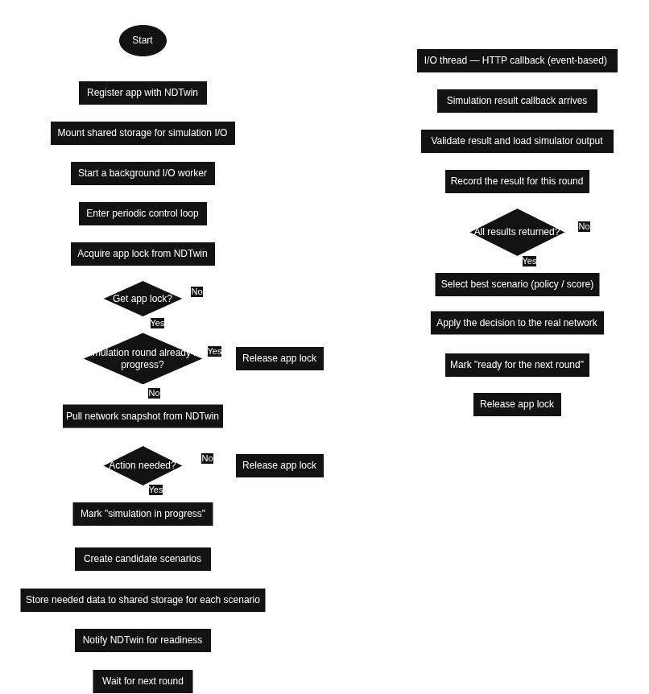

# NDTwin Application Structure
This section describes the overall architecture and execution flow of an NDTwin application.
The application operates in two cooperating execution contexts:

* a **periodic main control thread**
* an **event-driven I/O thread** for simulation callbacks

---
## 1. High-Level Pseudo Code
```
START
  Register app with NDTwin (enable simulator callback)
  Mount shared storage (e.g., NFS) for simulation I/O
  Start a background I/O worker:
      - runs the HTTP server
      - receives simulation results

MAIN THREAD (runs every fixed interval)
  Acquire App lock from NDTwin
    If a simulation round is already in progress:
        Release App lock to NDTwin
        Wait until next interval
        Continue

    Pull current network snapshot from NDTwin:
        - topology + device states
        - flow rules
        - observed traffic/flows

    If action is needed (e.g., save energy or relieve congestion):
        Mark “simulation in progress”
        Create one or more candidate scenarios (e.g., power OFF / power ON choices)
        Submit scenarios to the NDTwin
    else
        Release App lock to NDTwin
        Wait until next interval
        Continue
  Wait until next interval

I/O THREAD (HTTP callback path, event-driven)
  On simulation-result callback:
    Validate result and load simulator output
    Record the result for this round

    If all scenarios for the round have returned:
        Select the best scenario (by policy/score)
        Apply the decision to the real network:
            - power on/off selected devices
            - wait for readiness
            - install/modify flow rules in the right order
        Mark “ready for next round”
        Release App lock to NDTwin
```


---

## 2. Flow Chart
Figure: NDTwin Application Control Flow (Main Thread & I/O Thread)




---

## 3. Component Explanations
### 3.1 Application Initialization
Purpose: Prepare the app to interact with NDTwin.

* Registers the application so NDTwin knows where to send simulation callbacks
* Mounts shared storage for simulation input/output files
* Starts the background I/O worker (HTTP server)

This phase runs once at startup.

### 3.2 Main Control Thread (Periodic Loop)
Purpose: Decide when and what control actions should be simulated.

Key responsibilities:

* Ensures only one control round from one application runs at a time using an application-level lock
* Pulls a consistent snapshot of the current network state
* Evaluates policies (e.g., energy saving, congestion relief)
* Generates and submits candidate scenarios to NDTwin

This thread never blocks waiting for simulation results.

### 3.3 Application Lock (Coordination Mechanism)
Purpose: Prevent overlapping control rounds from one or several applications.

* Acquired before reading network state or submitting simulations
* Released only after all simulation results are processed
* Guarantees deterministic decision making, and eliminates conflicts between different applications

### 3.4 I/O Thread (Simulation Callback Handler)
Purpose: Handle simulation results asynchronously.

Triggered by NDTwin when:
* a simulator finishes execution
* a scenario result becomes available

Responsibilities:
* Validates and parses simulation outputs
* Tracks which scenarios have returned
* Determines when a round is complete

### 3.5 Decision & Actuation Phase
Purpose: Apply the best simulation outcome to the real network.

Actions may include (take energy-saving app as an example):
* Powering devices on/off
* Waiting for device readiness
* Installing or modifying flow rules in a safe order

Once completed:
* The system is marked ready for the next control round
* The application lock is released


---

## 4. Design Characteristics
* Event-driven + periodic hybrid model
* Simulation-in-the-loop control
* Non-blocking main loop
* Strong separation between decision logic and execution
* Safe concurrency via explicit locking