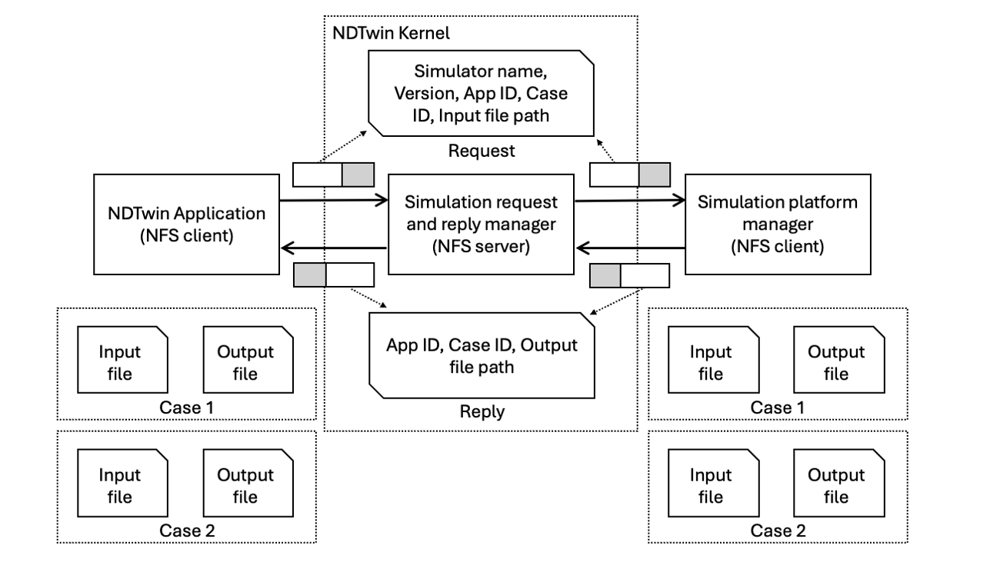

---

### 1. Key Components

The system comprises three main components:

i. Client Application (e.g., NDT App) This component analyzes system states to generate candidate simulation cases. It handles data preparation by storing input files on the shared Network File System (NFS) and subsequently dispatches simulation requests to the NDT Core.

ii. Simulation Request & Reply Manager Acts as the central communication bridge, relaying requests and replies between the Client Application and the Simulation Server.

iii. Simulation Server Responsible for the heavy lifting, this server receives cases and forks processes to simulate them in parallel on a multi-core CPU. It evaluates the outcomes, writes the results back to NFS, and sends a completion reply to the NDT Core to notify the Client Application.

---

### 2. Workflow Execution Cycle

1. **Initiation:** The Client Application generates simulation scenarios, writes the input data to NFS, and signals the NDT Core.
2. **Processing:** The Simulation Server reads the inputs, executes simulations in parallel, and writes the results back to NFS.
3. **Completion & Decision:**
* The Client Application waits for replies confirming all cases are finished.
* It reads the output files from NFS to retrieve the detailed results.
* It compares the outcomes to select the **optimal plan**.

4. **Execution:** The Client Application instructs the NDT Core to execute network changes based on the selected best plan.

---

### 3. Data Exchange: Network File System (NFS)

> **Why NFS?**
> Simulation inputs and outputs often contain large datasets that are inefficient to transfer via **RESTful API** calls. NFS provides a high-performance mechanism for sharing this data.

#### Roles and Responsibilities

* **NDT Core (NFS Server):** Exports file directories, acting as the central storage hub.
* **Client App & Simulation Server (NFS Clients):** Mount these directories to perform direct read/write operations.

#### Data Flow Strategy

| Stage | Client Application | Simulation Server |
| --- | --- | --- |
| **Pre-Simulation** | **Writes** simulation input parameters | **Reads** input parameters to initialize |
| **Post-Simulation** | **Reads** simulation results | **Writes** performance metrics/results |

---

### 4. Simulation Request Protocol

As illustrated in the system design, a simulation request carries specific metadata required for routing and execution.

| Field | Description |
| --- | --- |
| **Simulator Name** | Identifies which simulator program the server should execute. |
| **Version** | Specifies the target version of the simulator (supporting multi-version environments). |
| **App ID** | The unique ID of the requesting NDT Application. This ensures the NDT Core routes the reply back to the correct application in a multi-user environment. |
| **Case ID** | A unique identifier used by the application to track and distinguish its specific simulation cases. |
| **Input File Path** | The absolute path to the input file on NFS, allowing the server to locate and read the case data. |

## 6. Developer Guide

### 6.1 Code Structure Overview

| Path | Description |
| --- | --- |
| `include/sim/max_min_fairness.hpp` | **Algorithm Core.** Defines the bandwidth allocation logic. |
| `src/sim/max_min_fairness.cpp` | Implementation of Max-Min Fairness. |
| `include/common/SFlowType.hpp` | **Data Structures.** Contains Flow definitions. |
| `registered/power_sim/` | **Binaries.** Where the server looks for executable simulators. |

### 6.2 The Max-Min Fairness Algorithm

* **Location:** `src/sim/max_min_fairness.cpp`
* **Function:** When the simulation proposes new routing rules, this algorithm calculates how much bandwidth each flow will receive.
* **Logic:** Currently, the algorithm assumes all flows are **greedy** (they will take as much bandwidth as possible).
* **Customization:** The code is structured to allow for specific bandwidth demands (QoS) in the future. If you need to simulate flows with fixed bandwidth limits, modify the parameters here.

### 6.3 Synchronization with NDT

The Simulation Subsystem shares many data structures with the NDT project (specifically in `GraphTypes.hpp` and `SFlowType.hpp`).

* **Warning:** If the NDT source code updates its graph or flow definitions, you **must** copy those updates to this project to prevent data parsing errors (JSON mismatch).
* **Exception:** Do not overwrite the custom JSON conversion functions in `SFlowType.hpp` (`from_json` for `FlowChange`/`FlowDiff`) as these are specific to the Power Simulator.
