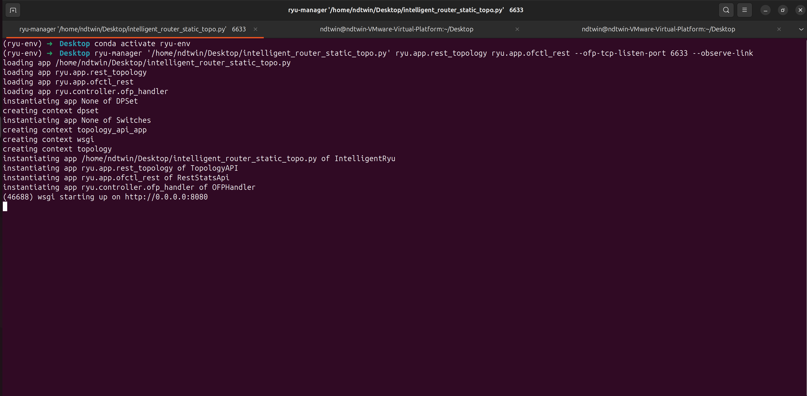
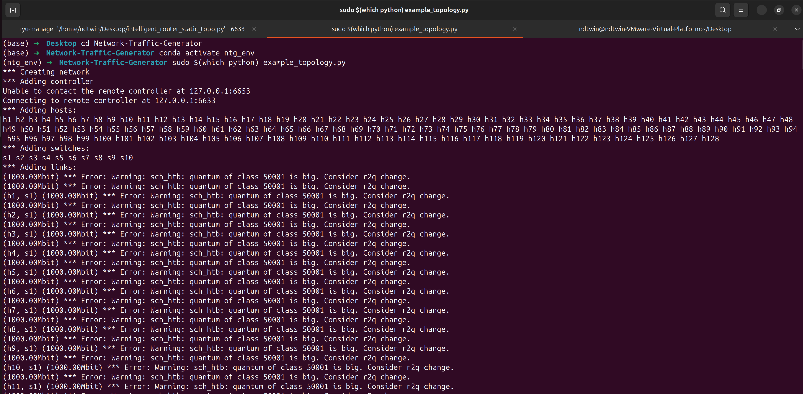
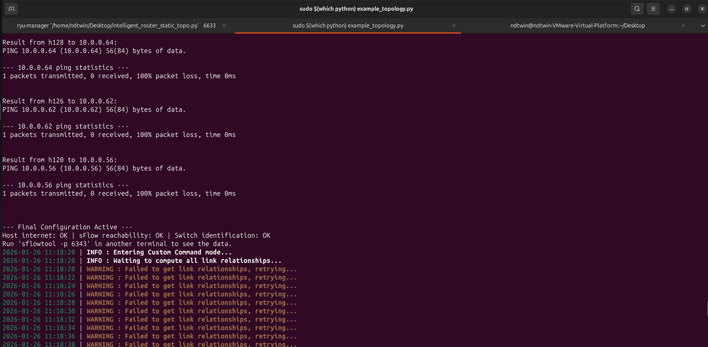
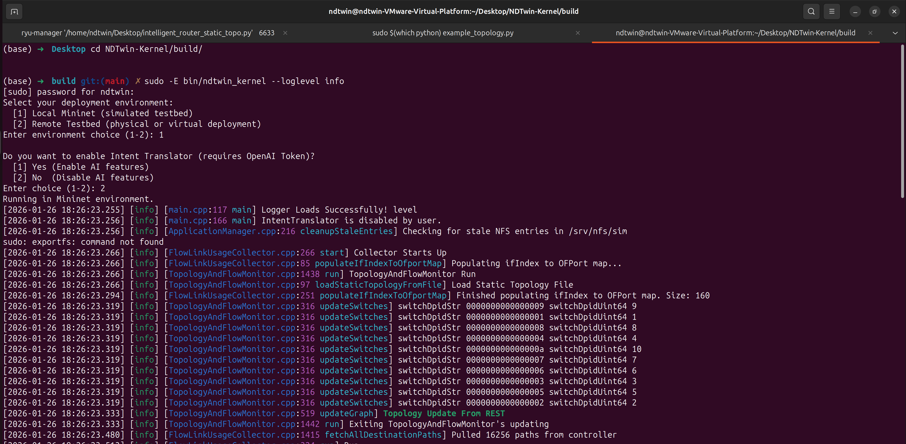

**Pre-flight Checks:**

* Please prepare **3 separate Terminal windows**.
* **Startup Order is Critical:** Please execute Terminals 1 through 3 in the exact order listed below.

---

## Terminal 1: Ryu Controller (SDN Controller)

* **Path:** `Desktop`
* **Environment:** `ryu-env` (Python 3.8)

1. Navigate to the directory:
```bash
cd ~/Desktop/

```

2. Clean up old network artifacts (**Crucial step**):
```bash
sudo mn -c

```


3. Activate the environment:
```bash
conda activate ryu-env

```


4. Execute the controller:
```bash
ryu-manager '/home/ndtwin/Desktop/intelligent_router_static_topo.py' ryu.app.rest_topology ryu.app.ofctl_rest --ofp-tcp-listen-port 6633 --observe-link

```



---

## Terminal 2: Mininet (Virtual Network Topology)

* **Path:** `Desktop`
* **Environment:** System Native (Root)

1. Navigate to the directory:
```bash
cd ~/Desktop/Network-Traffic-Generator/

```

2. Activate the environment:
```bash
conda activate ntg_env      

```

3. Start the topology:
```bash
sudo $(which python) example_topology.py

```



The user should wait until they see this screen.




---

## Terminal 3: NDT Kernel (Digital Twin Core)


1. Navigate to the Build Directory

Ensure you are in the directory containing the compiled binary.

```bash
cd ~/Desktop/NDTwin-Kernel/build/

```

2. Configure OpenAI API Key (Optional)

This step is **required** only if you intend to enable the **Intent Translator** feature. The system uses this key to authenticate with the OpenAI API.

> **Note:** If you plan to disable AI features in the interactive menu, you may skip this step.

```bash
export OPENAI_API_KEY="sk-proj-xxxxxxxxxxxxxxxx"

```

3. Execute the Kernel

Run the main executable with root privileges.

```bash
sudo -E bin/ndtwin_kernel --loglevel info

```


#### Interactive Configuration

Upon execution, the system will prompt you to select the operation mode:

1. **Deployment Environment:**
* `[1] Local Mininet`: Select for simulated local testbeds.
* `[2] Remote Testbed`: Select for physical or virtual remote deployments.


2. **AI Feature Toggle:**
* `[1] Yes`: Initializes the `IntentTranslator` with the OpenAI model. (Requires valid API Token).
* `[2] No`: Disables AI components to conserve resources.



---

## Safe Shutdown Procedure

When finishing your experiment, please close the system in **reverse order** and perform cleanup to avoid errors in future runs:

1. In **Terminal 2 (Mininet)**, type `exit` to quit the CLI.
2. In **Terminal 2**, run the cleanup command:
```bash
sudo mn -c
```
3. Close all other terminal windows.


