# Network Traffic Visualizer GUI Features Documentation

## Table of Contents

1. [Network Topology](#network-topology)
2. [Flow Visualization](#flow-visualization)
3. [Link Utilization](#link-utilization)
4. [Playback Mode](#playback-mode)
5. [Sidebar Functions](#sidebar-functions)
6. [Information Panels](#information-panels)

---

## Network Topology

### Overview

The Network Topology view provides an interactive visualization of the network infrastructure, displaying network devices (hosts and switches), links, and their relationships in real-time or during playback.

### Key Features

#### 1. Topology Visualization

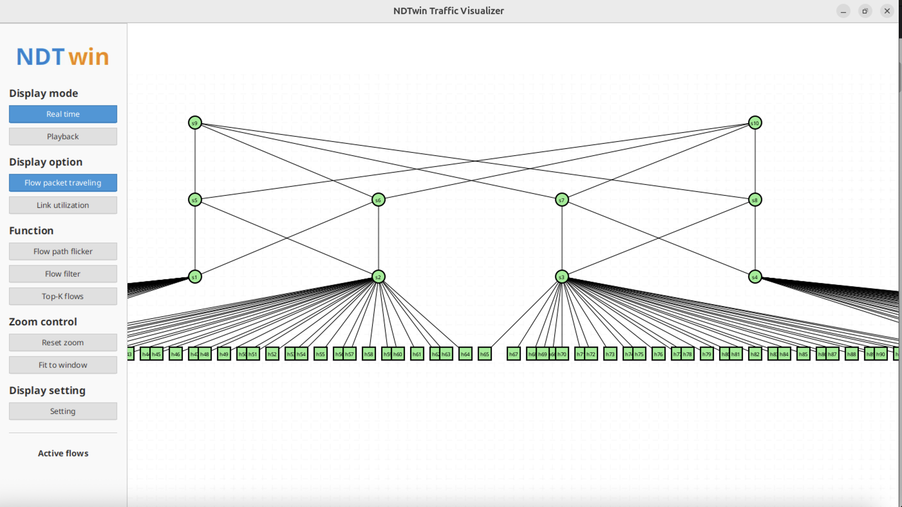

In the Network Topology view, users can directly view the current network topology. Users can drag and drop nodes (hosts/switches) to reposition them, and use the mouse wheel to zoom in and out, adjusting the view to their preferred layout.

The topology automatically applies a Fat-Tree layout algorithm to organize nodes into layers (Core, Aggregation, Edge, and Host layers), providing a clear hierarchical view of the network structure.

#### 2. Node Interaction

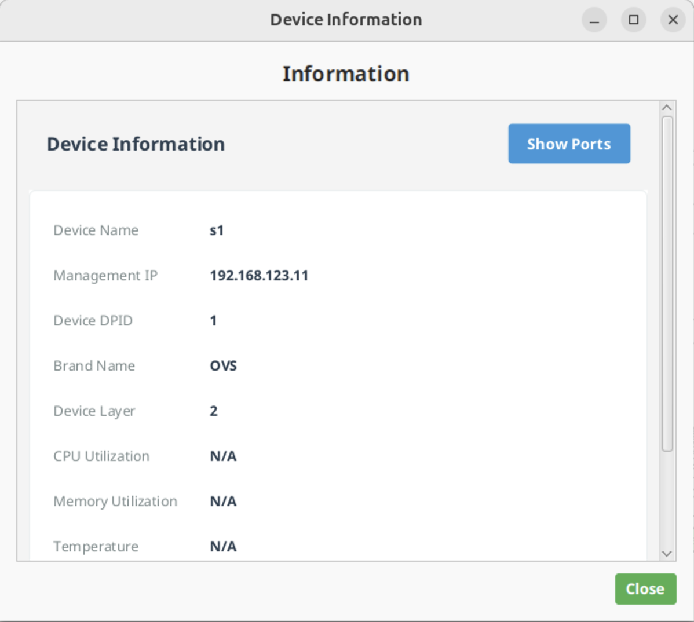

Users can click on any node (host/switch) to view detailed device information. The information panel displays:
- Device name and IP address
- Device type (host or switch)
- Device status (up/down, enabled/disabled)
- CPU and memory utilization (if available)

Users can also drag nodes to reposition them. Node positions are automatically saved and restored when the application is restarted.

#### 3. Link Information

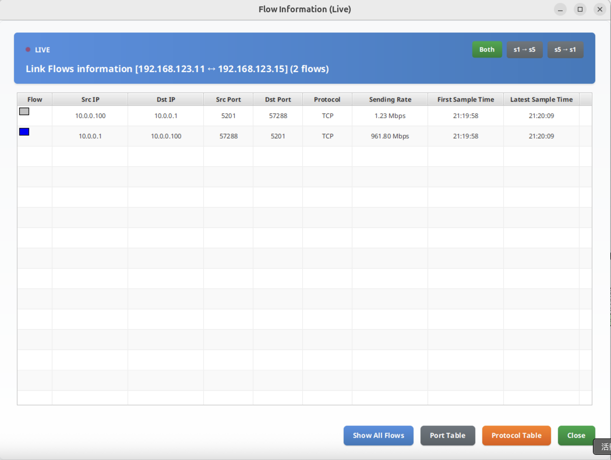

Clicking on any link (edge) displays information about that link in a panel. The panel shows:
- Source and destination nodes
- Link bandwidth and utilization
- Flow entries passing through the link
- Unidirectional and bidirectional flow information

#### 4. Node Positioning

Node positions are automatically saved when users drag and reposition nodes. The application maintains separate position files for real-time mode and playback mode, allowing users to have different layouts for different use cases.

When the topology changes (nodes added or removed), the application can automatically reapply the Fat-Tree layout algorithm or use saved positions if all nodes match.

---

## Flow Visualization

### Overview

The Flow Visualization feature displays network traffic flows as animated packets moving along network paths, providing a real-time view of data transmission across the network.

### Key Features

#### 1. Flow Only Mode

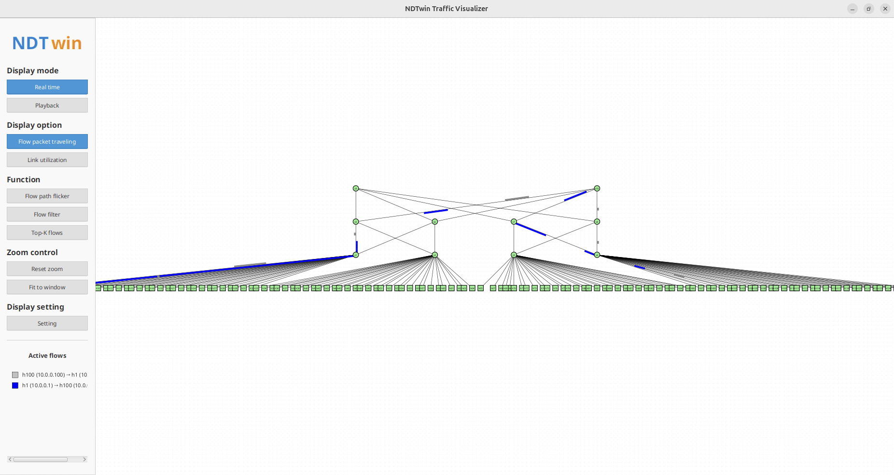

Users can use the "Flow packet traveling" mode to display only flow animations without showing link utilization colors. This mode is particularly useful for focusing on traffic patterns and flow paths.

The application displays flows as animated colored packets moving along their network paths. Each flow is assigned a unique color based on its five-tuple (source IP, destination IP, source port, destination port, protocol), ensuring consistent color representation across the interface.

Flows move along their complete paths, showing the actual route data takes through the network topology.

In this mode, the sidebar displays an "Active flows" legend showing the top 10 flows with their color indicators and source/destination information.

#### 2. Flow Path Highlighting

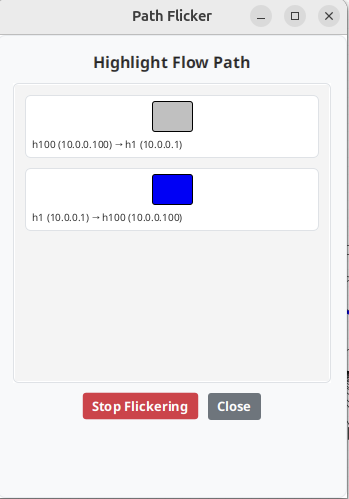

Users can use the "Flow path flicker" function to highlight specific flow paths. When a flow is selected, all links in that flow's path will flicker with a fluorescent green color, making it easy to trace the complete path of a specific flow.

The Path Flicker dialog displays all available flows (up to 50) with their color indicators. Clicking on a flow entry highlights its path, and clicking again stops the highlighting.

#### 3. Flow Filtering

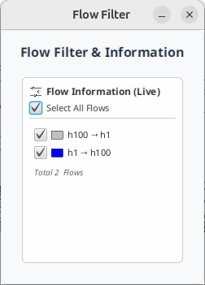

The application provides comprehensive flow filtering capabilities. Users can filter flows based on:
- Source IP address
- Destination IP address
- Source port
- Destination port
- Protocol ID

Filters can be combined using AND/OR logic, and the system supports expression-based filtering for advanced queries.

#### 4. Top-K Flows

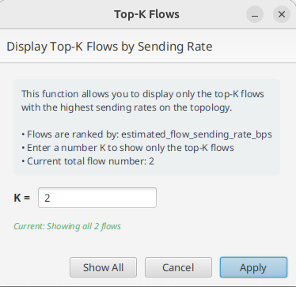

Users can display only the top-K flows with the highest sending rates. The Top-K Flows dialog allows users to:
- Enter a value K to show the top-K flows
- View current flow statistics
- Show all flows or apply the filter

The button in the sidebar shows the current status (e.g., "Top-K flows (10/50)") when the filter is active.

#### 5. Flow Information Panel

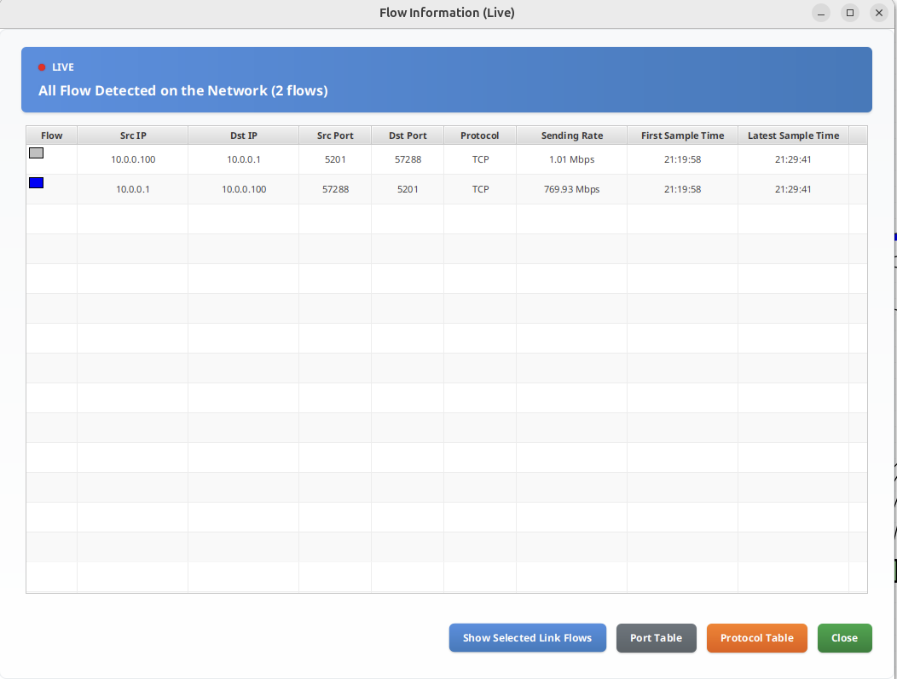

Clicking the button in the bottom-left corner displays all flows currently active in the network. Users can:
- Sort flows by various columns (Sending Rate, First Sample Time, Latest Sample Time)
- View detailed flow information including source/destination, ports, protocol, and timing
- Filter flows using the filter dialog

---

## Link Utilization

### Overview

The Link Utilization feature displays network link usage through color-coded visualization, helping users quickly identify congested or underutilized links.

### Key Features

#### 1. Link Color Coding

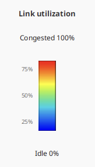

Each link is color-coded to indicate its utilization status:
- **Blue**: Lowest link usage (idle)
- **Green to Yellow**: Moderate usage
- **Orange to Red**: Highest link usage (congested)

The color gradient provides an intuitive visual representation of network congestion levels.

#### 2. Link Utilization Mode

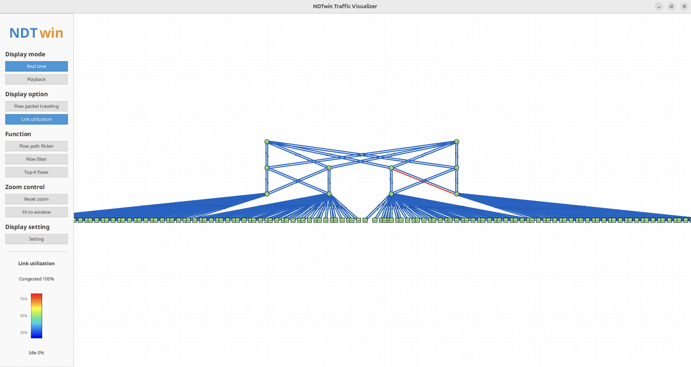

Users can switch to "Link utilization" mode to display only link colors without flow animations. This mode is useful for analyzing network capacity and identifying bottlenecks.

In this mode, the sidebar displays a "Link utilization" legend showing the color gradient from idle (0%) to congested (100%).

#### 3. Link Information Panel

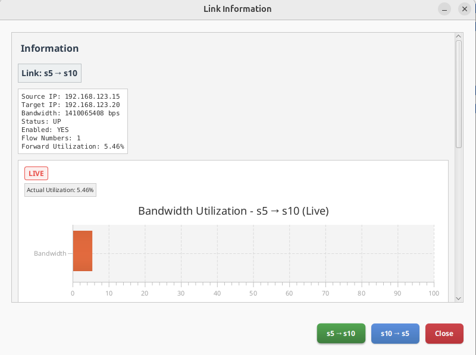

Clicking on a link opens a detailed information panel showing:
- Link bandwidth and current usage
- Utilization percentage
- List of flows passing through the link
- Unidirectional and bidirectional flow statistics

---

## Playback Mode

### Overview

The Playback Mode allows users to load and analyze historical network trace data, enabling retrospective analysis of network behavior.

### Key Features

#### 1. Opening History Trace Data

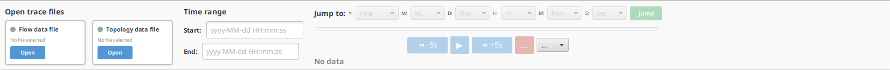

Users can load historical data files in two sections:
- **Flow Data**: Historical flow information (NDJSON format)
- **Topology Data**: Historical topology snapshots (NDJSON format)

**Important Note:** It is recommended that both Flow Data and Topology Data files be under 350MB each. Files exceeding 350MB may cause performance issues during analysis.

#### 2. Time Range Selection

After loading data files, users can specify a time range for playback:
- **Start Time**: Beginning of the analysis period
- **End Time**: End of the analysis period

The system automatically detects the available time range from the loaded data and allows users to adjust it as needed.

#### 3. Timeline Playback

Users can control playback using the timeline controls:
- **Timeline Slider**: Drag to jump to any point in time
- **Play/Pause Button**: Start or pause playback
- **Previous/Next Buttons**: Step through time frames
- **Stop Button**: Stop playback and reset to start
- **Speed Control**: Adjust playback speed (0.5x, 1x, 2x, 4x, 8x)

The current time is displayed in the format: `YYYY-MM-DD HH:MM:SS`.

#### 4. Jump to Time

Users can quickly jump to a specific time using the "Jump to Time" feature:
- Select year, month, day, hour, minute, and second from dropdown menus
- Click "Jump" to navigate to the selected time
- The timeline automatically updates to reflect the selected time

#### 5. Playback Data Alignment

The system uses intelligent data alignment to synchronize topology snapshots with flow data, ensuring accurate representation of network state at each time point.

---

## Sidebar Functions

### Overview
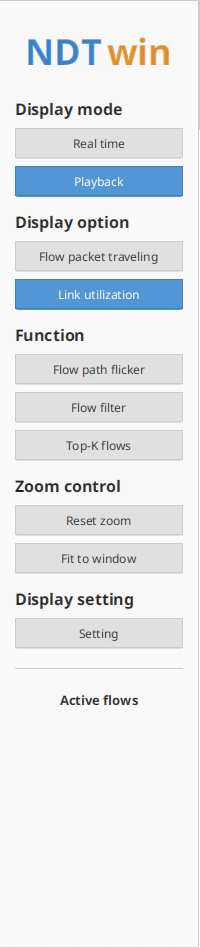

The Sidebar provides quick access to various display modes, functions, and settings for customizing the network visualization.

### Key Features

#### 1. Display Mode

Users can switch between two display modes:
- **Real time**: Live network data from API (updates every second)
- **Playback**: Historical data playback mode

Switching to Playback mode automatically opens the Playback Panel and pauses API updates.

#### 2. Display Options

Users can choose what to display:
- **Flow packet traveling**: Show only flow animations
- **Link utilization**: Show only link color coding

The selected option is highlighted in blue.

#### 3. Function Buttons

The Function section provides several useful tools:
- **Flow path flicker**: Open dialog to highlight specific flow paths
- **Flow filter**: Open flow filtering dialog
- **Top-K flows**: Display only the top-K flows by sending rate

#### 4. Zoom Controls

Users can control the view zoom:
- **Reset zoom**: Reset zoom level to default (1.0x)
- **Fit to window**: Automatically adjust zoom to fit all nodes in the view

Users can also use the mouse wheel to zoom in/out, and drag with the middle mouse button (or Ctrl+drag) to pan the view.

#### 5. Display Settings

Clicking "Setting" opens a dialog with the following options:
- **Dark Mode**: Toggle between light and dark theme
- **Flow traversal time per link**: Adjust how long a flow takes to traverse a single link (0.5 to 10 seconds)

Settings are automatically saved and restored when the application restarts.

#### 6. Active Flows Legend

When in "Flow packet traveling" mode, the sidebar displays an "Active flows" legend showing:
- Top 10 active flows with color indicators
- Source and destination information for each flow
- Format: `device_name (IP) → device_name (IP)`

If there are more than 10 flows, a message indicates the total number of flows.

#### 7. Link Utilization Legend

When in "Link utilization" mode, the sidebar displays a "Link utilization" legend showing:
- Color gradient from idle (0%) to congested (100%)
- Percentage markers at 0%, 25%, 50%, 75%, and 100%

---

## Information Panels

### Overview

The application provides various information panels that display detailed information about network elements when clicked.

### Key Features

#### 1. Node Information Panel

Clicking on a node opens an information panel displaying:
- Device name and nickname (editable)
- IP address(es)
- Device type and status
- CPU and memory utilization (if available)
- Connected ports (for switches)

For switch nodes, a "Show Ports" button appears, which opens a separate panel showing all ports and connected devices.

#### 2. Link Flow Information Panel

Clicking on a link opens a panel showing:
- Link endpoints (source and destination)
- Link bandwidth and utilization
- List of flows passing through the link
- Unidirectional and bidirectional flow entries
- Buttons to toggle between different views

#### 3. Flow Information Table

The Flow Information table displays all active flows with the following columns:
- Source IP
- Destination IP
- Source Port
- Destination Port
- Protocol
- Sending Rate
- First Sample Time
- Latest Sample Time

Users can sort by clicking column headers and apply filters to narrow down the displayed flows.

#### 4. Switch Port Panel

When viewing a switch node, clicking "Show Ports" opens a panel displaying:
- All ports on the selected switch
- Devices connected to each port
- Port status and information

Clicking on a port entry highlights the corresponding link in fluorescent green on the topology view.

---

## Additional Features

### 1. Dark Mode

The application supports a dark mode theme for better visibility in low-light environments. Dark mode can be toggled in the Settings dialog and affects:
- Background colors
- Text colors
- Button styles
- Panel appearances

### 2. Node Dragging and Positioning

Users can drag nodes to reposition them on the canvas. Nodes snap to a grid for alignment, and positions are automatically saved. The application maintains separate position files for real-time and playback modes.

### 3. View Navigation

Users can navigate the topology view using:
- **Mouse wheel**: Zoom in/out
- **Middle mouse button drag** (or **Ctrl + drag**): Pan the view
- **Reset zoom**: Return to default zoom level
- **Fit to window**: Automatically fit all nodes in view

### 4. Real-time Updates

In Real-time mode, the application automatically updates the topology and flow information every second by querying the NDTwin API. The API URL can be configured via the `NDT_API_URL` environment variable (default: `http://localhost:8000`).

---

## Notes

- All screenshots should be placed in an `` directory relative to this documentation file
- Screenshot filenames should be descriptive and match the placeholder names above
- Recommended screenshot resolution: 1920x1080 or higher
- Include UI elements and relevant context in screenshots

---

