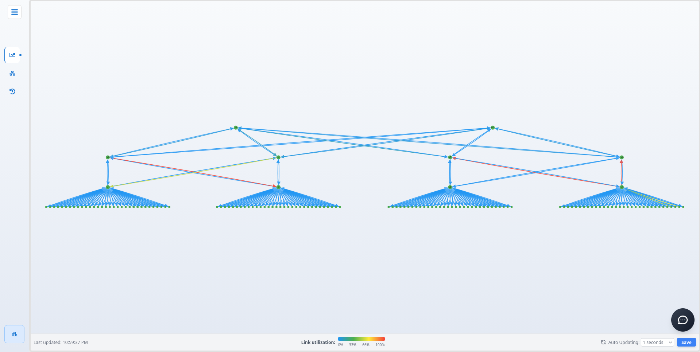
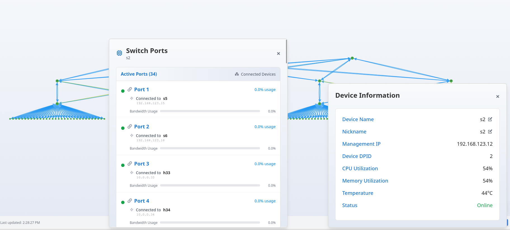
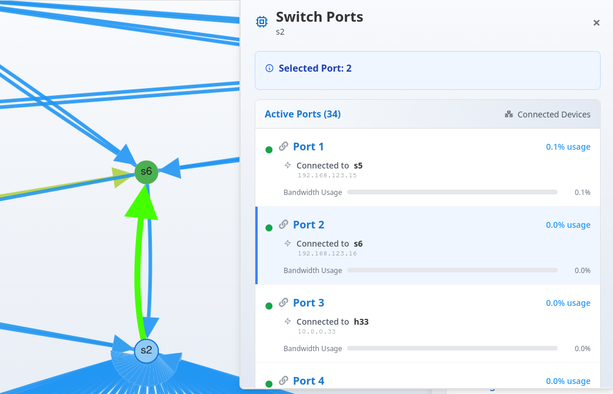
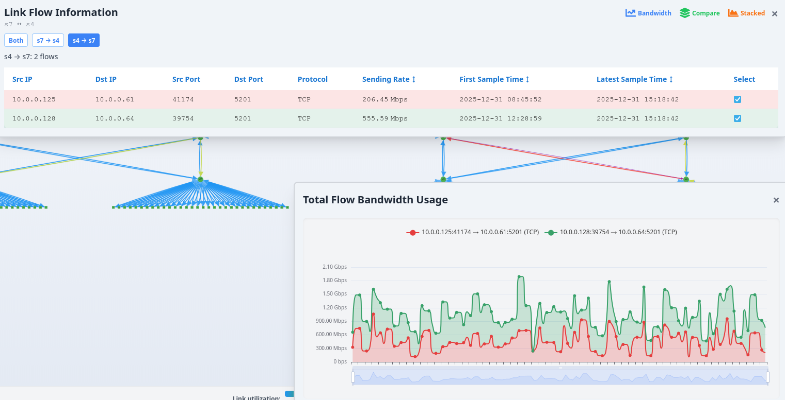
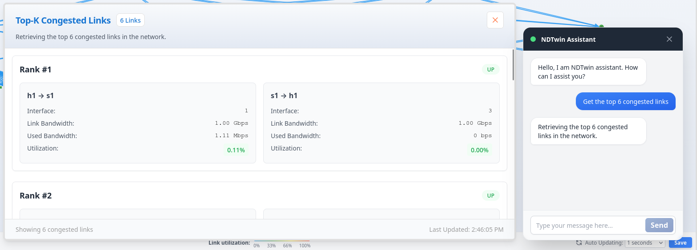
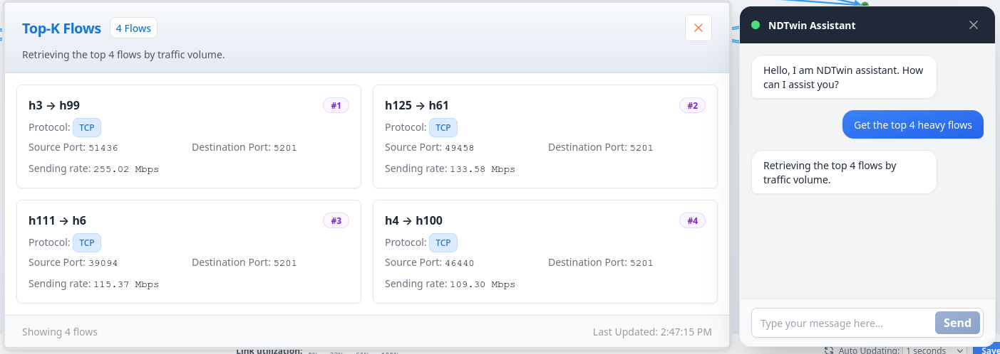
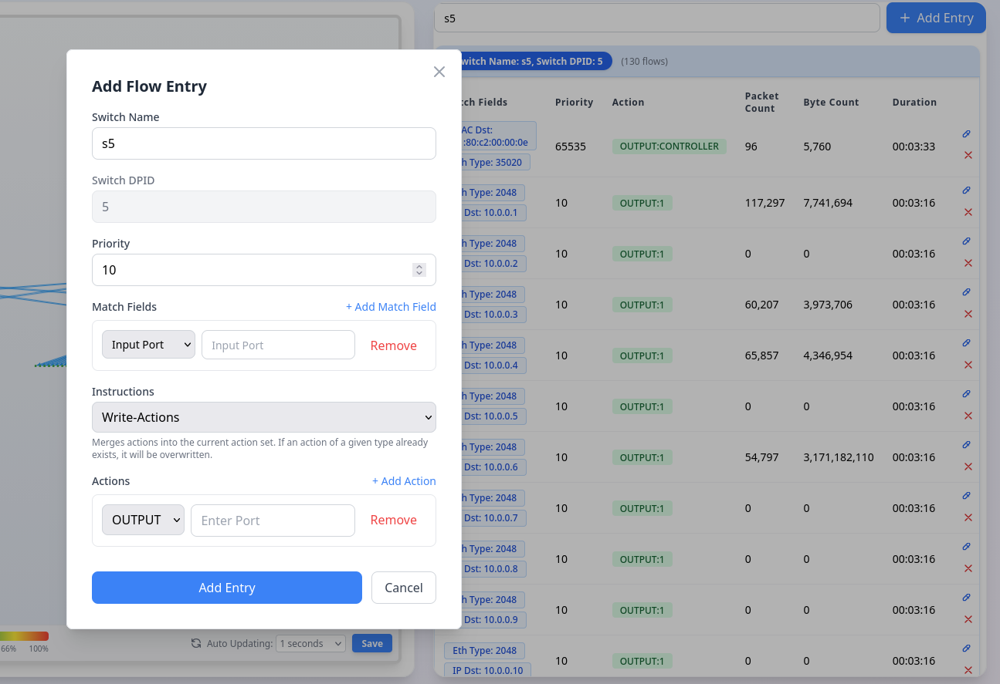
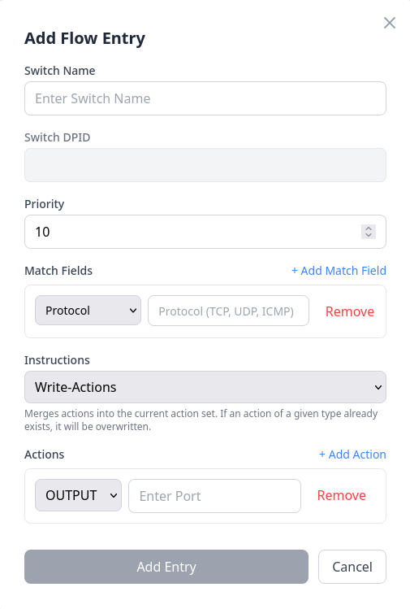
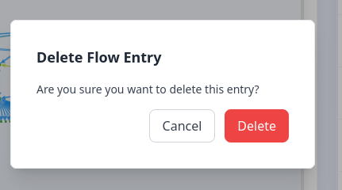

# NDTwin Web GUI Features Documentation
## Table of Contents

1. [Network Topology](#network-topology)
2. [Switch Flow Table](#switch-flow-table)
3. [Availability Status](#availability-status)

---

## Network Topology

### Overview

The Network Topology page provides an interactive visualization of the network infrastructure, displaying network devices, links, and their relationships in real-time.

### Key Features

#### 1. Topology Visualization

In the Network Topology page, users can directly view the current network topology. Users can drag and drop nodes (hosts/switches) to reposition them, and use the mouse wheel to zoom in and out, adjusting the view to their preferred layout.

Additionally, each link is color-coded to indicate its congestion status. Blue represents the lowest link usage, while red indicates the highest link usage, providing an intuitive visual representation of network congestion.

#### 2. Device Information Panel

Users can click on any node (host/switch) to open a panel displaying relevant device information. The panel allows users to modify the Device Name and Nickname to their preferred values. Note that the Device Name is limited to a maximum of four characters.

When clicking on a Switch device, a "Show Ports" button appears in the top-right corner of the Device Information panel. Clicking this button opens a Switch Ports panel that displays all ports on the selected switch and the devices connected to each port.

Users can click on any port entry in this panel, and the corresponding link connecting that switch port to a device will be highlighted in fluorescent green on the Network Topology view. This feature helps users quickly identify which link corresponds to a specific switch port connection.

#### 3. Link Flow Information Panel

Clicking on any edge (link) displays information about that link in a panel. The panel shows unidirectional and bidirectional flow entries, with buttons to toggle between different views.

Three buttons are located in the top-right corner of the panel, each opening a different visualization:

**1. Bandwidth**

This panel displays a line chart showing the link bandwidth usage over the past 120 seconds.

**2. Compare**

When this panel is opened, users can select multiple flow entries from the Link Flow Information panel. The Flow Bandwidth Usage panel will overlay the bandwidth usage of these selected flows, allowing users to compare their performance side by side.

**3. Stacked**

When this panel is opened, users can select multiple flow entries from the Link Flow Information panel. The Flow Bandwidth Usage panel will display the bandwidth usage of these flows in a stacked format, enabling users to observe the cumulative bandwidth consumption and individual flow contributions.

#### 4. Flow Information

Clicking the button in the bottom-left corner displays all flows currently active in the network. Users can sort flows by clicking on column headers such as Sending Rate, First Sample Time, and Latest Sample Time in ascending or descending order.

The Flow Information Panel includes several buttons in the top-right corner with different functionalities:

**1. Pause**

The first button pauses fetching new data, allowing users to focus on flow information at a specific point in time.

**2. Common Ports**

The second button displays a reference table showing common ports and their corresponding protocols.

**3. Filter**

The third button enables filtering of current flows. Users can select desired filter rules to narrow down the displayed flows. For example, as shown in the image above, users can filter flows where the Source IP is `10.0.0.8` or `10.0.0.62`.

Additionally, the system supports Expression Filter functionality, allowing users to input simple rules to filter flows. As shown in the example above, using the expression `(src_ip == "10.0.0.8" OR src_ip == "10.0.0.62")` will filter and display all flows with Source IP addresses matching `10.0.0.8` or `10.0.0.62`.

**4. Discard**

The fourth button removes all currently applied filter rules, returning the view to display all flow entries.

#### 5. Node Positioning

A "Save" button is located in the bottom-right corner of the Network Topology page. Clicking this button saves the current positions of all nodes in the topology. Since users can freely drag and reposition nodes (hosts/switches), they can arrange the topology to their preferred layout and then click "Save" to persist these positions. When the page is refreshed, the topology will be laid out according to the last saved node positions.

#### 6. NDTwin Assistant

A chat button is located in the bottom-right corner of the screen. Clicking it opens the NDTwin Assistant window, which allows users to perform various operations by entering natural language prompts. The NDTwin Assistant can either display analysis results in a panel or automatically navigate to the Switch Flow Table page with pre-filled information. The following prompt types are currently supported:

**1. Get the top k congested links**

The NDTwin Assistant analyzes the current network information and displays a panel showing the top k most congested links in the network.

**Example:**

When you input "Get the top 6 congested links", after a few seconds, a panel will appear displaying the top 6 most congested links in the current network.

**2. Get the top k heavy flows**

The NDTwin Assistant analyzes the current network information and displays a panel showing the top k heaviest flows in the network.

**Example:**

When you input "Get the top 4 heavy flows", after a few seconds, a panel will appear displaying the top 4 heaviest flows in the current network.

**3. Install flow entry on `<switch>` --confirm**

When this prompt is entered, the NDTwin Assistant automatically navigates to the Switch Flow Table page and pre-fills the Add Flow Entry form with the specified switch information. Users only need to fill in the remaining parameters they wish to add.

**Example:**

When you input "Install flow entry on s5", the NDTwin Assistant will automatically navigate to the Switch Flow Table page and pre-fill the Add Flow Entry form with switch "s5" selected. Users can then complete the remaining fields (match fields, actions, priority, etc.) and click "Add Entry" to install the flow rule.

**4. Modify flow entry on `<switch>` --confirm**

When this prompt is entered, the NDTwin Assistant automatically navigates to the Switch Flow Table page and pre-fills the Modify Flow Entry form with the specified switch information. Users only need to modify the parameters they wish to change.

**Example:**

When you input "Modify flow entry on s3", the NDTwin Assistant will automatically navigate to the Switch Flow Table page and pre-fill the Modify Flow Entry form with switch "s3" selected. Users can then modify the desired parameters and click "Modify Entry" to update the flow rule.

**5. Delete flow entry on `<switch>` --confirm**

When this prompt is entered, the NDTwin Assistant automatically navigates to the Switch Flow Table page and applies a filter for the specified switch. This allows users to quickly locate the flow entry they want to delete and click the delete button to remove it.

**Example:**

When you input "Delete flow entry on s6", the NDTwin Assistant will automatically navigate to the Switch Flow Table page and apply a filter showing only flow entries for switch "s6". Users can then quickly locate the specific flow entry they want to delete and click the delete button to remove it.

---

## Switch Flow Table

### Overview

The Switch Flow Table page provides detailed information about flow entries installed on network switches, allowing administrators to view, manage, and modify flow rules.

### Key Features

#### 1. Flow Table Display

The Flow Table on the right side displays all flow rules currently configured on each switch. A filter is provided at the top of the page, allowing users to enter a Switch Name. When a switch name is entered, the Flow Table will only display all rules for that specific switch.

#### 2. Flow Entry Management

The system supports comprehensive flow rule management, providing three types of operations: Add Flow Entries, Modify Flow Entries, and Delete Flow Entries.

**Operations:**

- Add Flow Entries:

Clicking the "Add Entry" button in the top-right corner opens a panel where users can input the desired rule parameters for a specified switch. After filling in the required information, clicking "Add Entry" will add a new flow rule entry to the specified switch.

Match Fields Note:
When adding or modifying flow entries, users can select the desired match fields according to their requirements. It is important to note that when selecting the Protocol field, users must enter an English string name (**TCP**, **UDP**, or **ICMP**). Additionally, once a protocol is specified, users must also select the corresponding protocol-specific match fields. For **TCP**, the corresponding fields are `tcp_src` (TCP Source Port) and `tcp_dst` (TCP Destination Port). For **UDP**, users should select `udp_src` (UDP Source Port) and `udp_dst` (UDP Destination Port). When **ICMP** is chosen, the required fields are `icmpv4_type` (ICMPv4 Type) and `icmpv4_code` (ICMPv4 Code). In addition to protocol-specific fields, users can also configure common match fields such as `eth_type` (Ethertype), `ipv4_src` (Source IP), and `ipv4_dst` (Destination IP), which are available regardless of the selected protocol. Users can add multiple match fields as needed by clicking the "+ Add Match Field" button to create flexible and precise flow rule definitions.

- Modify Flow Entries:

To modify a flow rule entry, first locate the desired flow rule entry in the table, then click the Modify button (pencil icon) on the right side of the entry. This opens a panel pre-filled with the current flow rule information. Users can modify the desired parameters and click "Modify Entry" to successfully update the flow rule.

- Delete Flow Entries:

To delete a flow rule entry, first locate the desired flow rule entry in the table, then click the Delete button (X icon) on the right side of the entry. A confirmation panel will appear asking whether to delete the flow rule. Clicking "Delete" will successfully remove the flow rule entry.

---

## Availability Status

### Overview

The Availability Status page serves as a tool for users to open and analyze historical trace data. This page helps visualize information from historical trace data files.

The functionality supported in this page is largely similar to the Network Topology page. This section will only describe features unique to the Availability Status page.

### Key Features

#### 1. Open History Trace Data

Users should first open their desired historical data files in the Flow Data and Topology Data sections.

**Important Note:** It is recommended that both Flow Data and Graph Data files be under 350MB each. Files exceeding 350MB may cause slight performance issues during analysis.

#### 2. Timeline Play

Users can adjust the timeline position to observe network information at a specific point in time. The play button allows users to watch the network conditions during a selected time period. Additionally, users can set the playback speed in the Timeline to adjust the observation speed to their preference.

#### 3. All Data Bandwidth Usage

In the Availability Status page, clicking on a link opens the Link Flow Information panel, similar to the Network Topology page. A button labeled "All Data" is located in the top-right corner of this panel. This feature displays a comprehensive line chart showing the bandwidth usage of the selected link throughout the entire time period covered by the trace data.